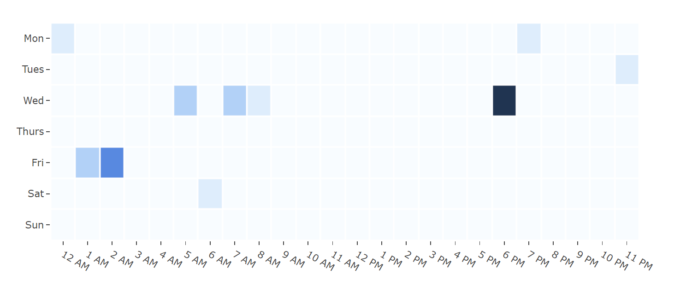

# Issue Age

This metric is an indication of how long issues have been left open in the considered time period. If an issue has been closed but re-opened again within that period if will be considered as having remained open since its initial opening date.

